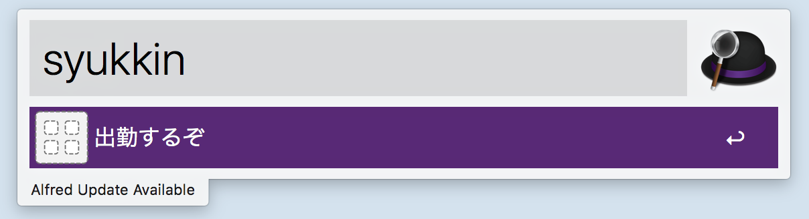
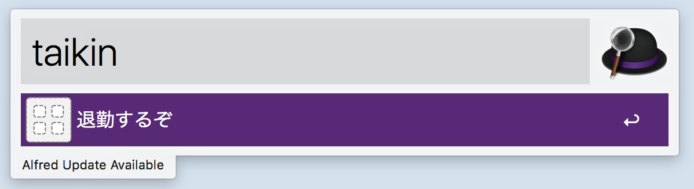

# kinnosuke.alfredworkflow

## usage

出勤時：



退勤時：



## require

* https://github.com/yano3/kinnosuke-clocking-cli

## configure

Write to`~/.kinnosuke` following configure:

```
# set path kinnosuke-clocking-cli
export PATH=~/bin:$PATH

export KINNOSUKE_COMPANYCD="XXXXXX"
export KINNOSUKE_LOGINCD="XXXX"
export KINNOSUKE_PASSWORD="XXXXXXXX"
```

